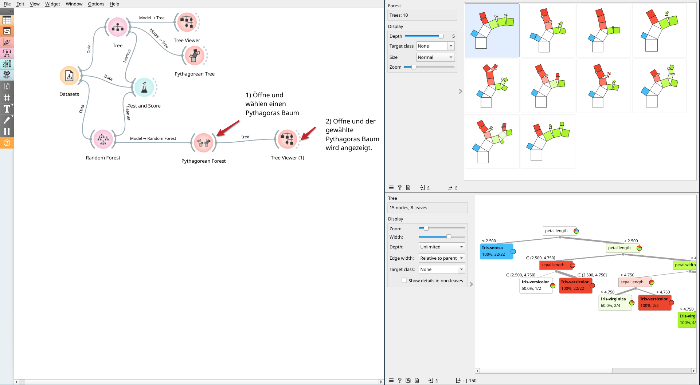

# Automatische Datenanalyse mit Orange3 und Python

- [Automatische Datenanalyse mit Orange3 und Python](#automatische-datenanalyse-mit-orange3-und-python)
  - [Am Beispiel des Iris Datensatz](#am-beispiel-des-iris-datensatz)
    - [Merkmale des Iris-Datensatzes](#merkmale-des-iris-datensatzes)
    - [Warum eignet sich der Datensatz gut?](#warum-eignet-sich-der-datensatz-gut)
  - [kNN (k-Nächste-Nachbarn-Modell)](#knn-k-nächste-nachbarn-modell)
    - [Einstieg (kNN)](#einstieg-knn)
    - [Automatische Datenanalyse mittels Orange3 (kNN)](#automatische-datenanalyse-mittels-orange3-knn)
    - [Automatische Datenanalyse mittels Python](#automatische-datenanalyse-mittels-python)
  - [Random Forest](#random-forest)
    - [Einstieg (Random Forest)](#einstieg-random-forest)
      - [Beispiele](#beispiele)
    - [Automatische Datenanalyse mittels Orange3 (Random Forest)](#automatische-datenanalyse-mittels-orange3-random-forest)
    - [Automatische Datenanalyse mittels Python (Random Forest)](#automatische-datenanalyse-mittels-python-random-forest)
  - [Link-Halde](#link-halde)

## Am Beispiel des Iris Datensatz

<https://de.wikipedia.org/wiki/Portal:Statistik/Datens%C3%A4tze#Iris>

Beim Iris Datensatz, handelt es sich um einen Datensatz mit 150 Beobachtungen
von 4 Attributen der Blüte von [Schwertlilien](https://de.wikipedia.org/wiki/Schwertlilien).

Gemessen wurden dabei jeweils die Breite (`width`) und die Länge (`length`) des
Kelchblatts (**Sepalum**) sowie des Kronblatts (**Petalum**) in Zentimeter (cm). Des
weiteren ist für jeden Datensatz die Art der Schwertlilie ([Iris setosa](https://de.wikipedia.org/wiki/Borsten-Schwertlilie), [Iris
virginica](https://en.wikipedia.org/wiki/Iris_virginica) oder [Iris versicolor](https://de.wikipedia.org/wiki/Verschiedenfarbige_Schwertlilie)) angegeben. Für jede der 3 Schwertlilienarten liegen 50
Datensätze vor.

### Merkmale des Iris-Datensatzes

- Datenpunkte: 150
- Klassen: 3 (Iris Setosa, Iris Versicolour, Iris Virginica)
- Merkmale pro Datenpunkt: 4 (Sepallänge, Sepalbreite, Petallänge, Petalbreite)
- Problemart: Klassifikation

### Warum eignet sich der Datensatz gut?

- Übersichtlichkeit: Nur 4 Merkmale und 3 Klassen.
- Verständlichkeit: Leicht zu visualisieren, da die Merkmale klare biologische Bedeutungen haben.
- Standard-Beispiel: Häufig in Lehrmaterialien verwendet, was den Zugang zu zusätzlichen Ressourcen erleichtert.

## kNN (k-Nächste-Nachbarn-Modell)

### Einstieg (kNN)

Das k-Nächste-Nachbarn-Modell entscheidet auf Basis der Zielmerkmale der
Datenpunkte mit den ähnlichsten Merkmalsausprägungen (die nächsten Nachbarn)

- [Biberaufgabe 2020: Neues Haus](neues_haus.pdf)

### Automatische Datenanalyse mittels Orange3 (kNN)

- <https://orange3.readthedocs.io/projects/orange-visual-programming/en/latest/widgets/model/knn.html>
- [Orange3 Hilfekarte kNN (pdf)](orange3_hilfekarte_knn.pdf)
- Orange3 Projektdatei: [orange3_iris_knn.ows](orange3_iris_knn.ows)


### Automatische Datenanalyse mittels Python

Mittels scikit-learn und Nearest Neighbors Classification (KNeighborsClassifier)

- <https://scikit-learn.org/stable/modules/neighbors.html#classification>
- <https://scikit-learn.org/stable/modules/generated/sklearn.neighbors.KNeighborsClassifier.html#sklearn.neighbors.KNeighborsClassifier>

Benötigte Biblotheken installieren

```shell
pip install matplotlib seaborn scikit-learn numpy
```

Ausführen

```python
python knn.py
```

k=3             |  k=15
:-------------------------:|:-------------------------:
 | 

## Random Forest

### Einstieg (Random Forest)

Random Forest Modelle enthalten mehrere Entscheidungsbäume und stimmen im
Mehrheitsverfahren ab.

#### Beispiele

Spotify:

- <https://schuster-j.github.io/spotify-machinelearning/#optimierung-4>

Aktien:

- <https://thedlf.de/warum-kuenstliche-intelligenz-ki-keine-aktienprognosen-kann/>
- <https://www.youtube.com/watch?app=desktop&v=MItd570HlLc>
- <https://www.sciencedirect.com/science/article/pii/S2405844019359705#sec4>

computergestütze Biologie:

- <https://support.minitab.com/de-de/minitab/21/help-and-how-to/statistical-modeling/predictive-analytics/how-to/random-forests-classification/before-you-start/example/>

### Automatische Datenanalyse mittels Orange3 (Random Forest)

- Einstieg: <https://www.youtube.com/watch?v=gSQsFIMcA8A>
- <https://orangedatamining.com/blog/pythagorean-trees-and-forests/>
- [Orange3 Hilfekarte Random Forest (pdf)](orange3_hilfekarte_random_forest.pdf)
- Orange3 Projektdatei: [orange3_iris_random_forest.ows](orange3_iris_random_forest.ows)



### Automatische Datenanalyse mittels Python (Random Forest)

Erstellung eines Random Forest mit 3 Bäumen und Speicherung der 3 Bäumen als png-Dateien.

```shell
python rf.py
```

Erstellung des Klassifikationsberichts.

```shell
python rf_report.py
```

## Link-Halde

<https://www.wanderinformatiker.at/unipages/general/iris.html>
