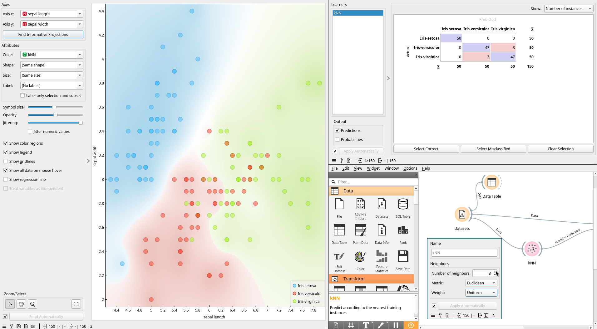
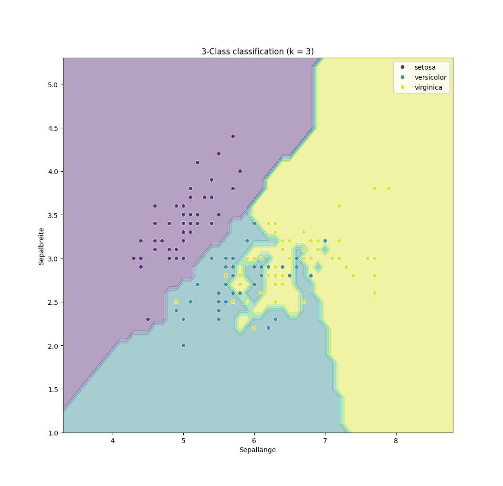
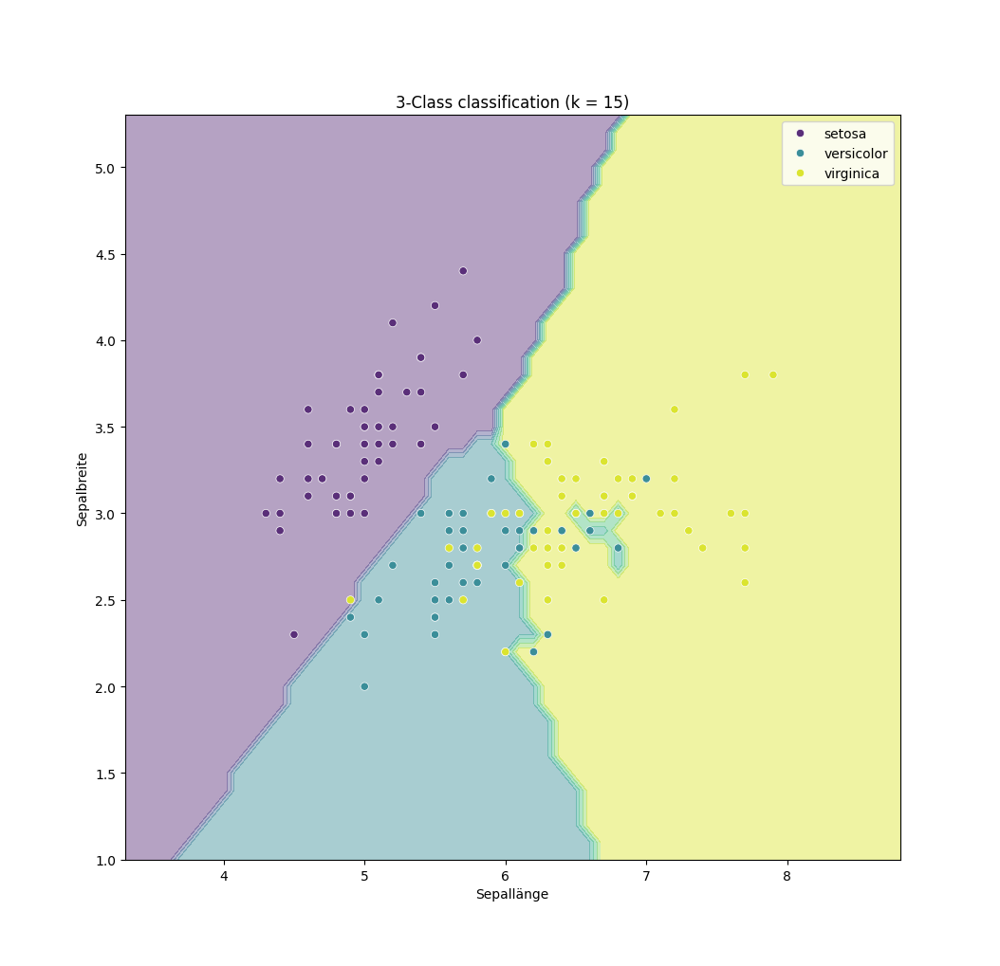

# Automatische Datenanalyse

- [Automatische Datenanalyse](#automatische-datenanalyse)
  - [Am Beispiel des Iris Datensatz](#am-beispiel-des-iris-datensatz)
    - [Merkmale des Iris-Datensatzes](#merkmale-des-iris-datensatzes)
    - [Warum eignet sich der Datensatz gut?](#warum-eignet-sich-der-datensatz-gut)
  - [Automatische Datenanalyse mittels Orange3](#automatische-datenanalyse-mittels-orange3)
    - [kNN (k-Nächste-Nachbarn-Modell)](#knn-k-nächste-nachbarn-modell)
  - [Automatische Datenanalyse mittels Python](#automatische-datenanalyse-mittels-python)
    - [Mittels scikit-learn und Nearest Neighbors Classification (KNeighborsClassifier)](#mittels-scikit-learn-und-nearest-neighbors-classification-kneighborsclassifier)
      - [Benötigte Biblotheken installieren](#benötigte-biblotheken-installieren)
    - [Ausführen](#ausführen)
  - [Link-Halde](#link-halde)

## Am Beispiel des Iris Datensatz

<https://de.wikipedia.org/wiki/Portal:Statistik/Datens%C3%A4tze#Iris>

Beim Iris Datensatz, handelt es sich um einen Datensatz mit 150 Beobachtungen
von 4 Attributen der Blüte von [Schwertlilien](https://de.wikipedia.org/wiki/Schwertlilien).

Gemessen wurden dabei jeweils die Breite (`width`) und die Länge (`length`) des
Kelchblatts (**Sepalum**) sowie des Kronblatts (**Petalum**) in Zentimeter (cm). Des
weiteren ist für jeden Datensatz die Art der Schwertlilie ([Iris setosa](https://de.wikipedia.org/wiki/Borsten-Schwertlilie), [Iris
virginica](https://en.wikipedia.org/wiki/Iris_virginica) oder [Iris versicolor](https://de.wikipedia.org/wiki/Verschiedenfarbige_Schwertlilie)) angegeben. Für jede der 3 Schwertlilienarten liegen 50
Datensätze vor.

### Merkmale des Iris-Datensatzes

- Datenpunkte: 150
- Klassen: 3 (Iris Setosa, Iris Versicolour, Iris Virginica)
- Merkmale pro Datenpunkt: 4 (Sepallänge, Sepalbreite, Petallänge, Petalbreite)
- Problemart: Klassifikation

### Warum eignet sich der Datensatz gut?

- Übersichtlichkeit: Nur 4 Merkmale und 3 Klassen.
- Verständlichkeit: Leicht zu visualisieren, da die Merkmale klare biologische Bedeutungen haben.
- Standard-Beispiel: Häufig in Lehrmaterialien verwendet, was den Zugang zu zusätzlichen Ressourcen erleichtert.

## Automatische Datenanalyse mittels Orange3

### kNN (k-Nächste-Nachbarn-Modell)

Das k-Nächste-Nachbarn-Modell entscheidet auf Basis der Zielmerkmale der
Datenpunkte mit den ähnlichsten Merkmalsausprägungen (die nächsten Nachbarn)

- Einstieg: [Biberaufgabe 2020: Neues Haus](neues_haus.pdf)
- <https://orange3.readthedocs.io/projects/orange-visual-programming/en/latest/widgets/model/knn.html>
- [Orange3 Hilfekarte (pdf)](orange3_hilfekarte_knn.pdf)
  


## Automatische Datenanalyse mittels Python

### Mittels scikit-learn und Nearest Neighbors Classification (KNeighborsClassifier)

- <https://scikit-learn.org/stable/modules/neighbors.html#classification>
- <https://scikit-learn.org/stable/modules/generated/sklearn.neighbors.KNeighborsClassifier.html#sklearn.neighbors.KNeighborsClassifier>

#### Benötigte Biblotheken installieren

```shell
pip install matplotlib seaborn scikit-learn numpy
```

### Ausführen

```python
python iris.py
```

k=3             |  k=15
:-------------------------:|:-------------------------:
 | 

## Link-Halde

<https://www.wanderinformatiker.at/unipages/general/iris.html>
